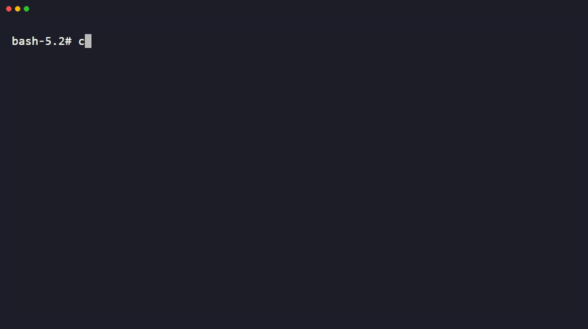

# demo-gif

Turns "add a demo GIF to this README" into a repeatable pipeline: pick the right recording method for the project, generate a reproducible recording script, render it, optimize the file size, and embed it in the README correctly.

Don't screen-record by hand and drop a 40 MB file in the repo. Every step here is scripted so the demo can be regenerated later when the tool changes.

## Step 1 — Detect what kind of demo fits

Look at the repo before picking a method.

| Signal | Demo type | Method |
|---|---|---|
| `bin/`, a CLI entry point, `package.json` with a `bin` field, argparse/click/cobra code, a Dockerfile that runs a command | CLI tool | Terminal recording (vhs) |
| A TUI framework (bubbletea, ratatui, textual, blessed, ink) | TUI | Terminal recording (vhs), larger window |
| `package.json` with a frontend framework, a dev server script, `index.html` | Web app | Browser recording (Playwright + ffmpeg) |
| A library/SDK with no standalone entry point — README shows import + usage snippets | Library | REPL or a short example script, recorded as a terminal session |

If it's ambiguous, ask which surface the demo should show (the CLI, a specific screen, a code example) rather than guessing.

## Step 2 — Generate the recording script

**Terminal (CLI, TUI, library REPL) — preferred path: vhs**

[VHS](https://github.com/charmbracelet/vhs) by Charm renders a `.tape` file (a plain-text script of terminal actions) into a GIF/MP4/WebM deterministically — same input, same output, every time. That reproducibility is why it's the default here over screen-recording software.

Install:
- macOS: `brew install vhs`
- Windows: `scoop install charmbracelet/tap/vhs` or `winget install charmbracelet.vhs`
- Linux (Debian/Ubuntu): `sudo apt install vhs ffmpeg` (also needs `ttyd` and `ffmpeg` on the PATH — vhs shells out to both)
- Any platform with Go: `go install github.com/charmbracelet/vhs@latest`
- Docker: `docker run --rm -v $PWD:/vhs ghcr.io/charmbracelet/vhs <file>.tape`

Write a `.tape` file. Minimum viable structure:

```tape
Output demo.gif

Set Shell "bash"
Set FontSize 18
Set Width 1200
Set Height 600
Set Theme "Dracula"

Type "your-cli --help"
Enter
Sleep 2s
```

See `references/tape-cookbook.md` for the full command reference, typing-cadence guidance, and patterns for hiding setup steps. `examples/cli-demo.tape` is a complete runnable example.

Render with:
```
vhs demo.tape
```

**Terminal fallback — no vhs available**

If vhs can't be installed (locked-down CI box, unsupported OS), record with [asciinema](https://asciinema.org/) and convert with [agg](https://github.com/asciinema/agg):

```
asciinema rec demo.cast
agg demo.cast demo.gif --theme monokai --speed 1.5 --idle-time-limit 2
```

`asciinema rec` captures a live session (less reproducible than a `.tape` script — there's no re-runnable source of truth), so prefer vhs whenever it's available. Full flag notes in `references/tape-cookbook.md`.

**Web app — Playwright + ffmpeg**

Playwright can record a real browser session to video via the `recordVideo` context option. Write a short script that opens the app, drives the interaction you want to show, and closes cleanly (the video only finalizes on context close).

```ts
const context = await browser.newContext({
  recordVideo: { dir: 'recordings', size: { width: 1280, height: 720 } },
});
const page = await context.newPage();
await page.goto('http://localhost:3000');
// ...drive the demo interaction...
await context.close(); // required — video is written on close
```

See `references/web-capture.md` for the full setup (including `page.video().saveAs()` to get a predictable filename) and `examples/web-demo.spec.ts` for a complete script. Convert the resulting `.webm`/`.mp4` to GIF with the ffmpeg two-pass palette flow in Step 4 — don't skip straight to a naive single-pass GIF encode, it produces banding on anything but flat-color UI.

## Step 3 — Render

- Terminal: `vhs demo.tape` produces the GIF (or MP4/WebM — set the extension in the `Output` line) directly.
- Web: run the Playwright script, then convert video to GIF (Step 4 covers the conversion, which doubles as the optimization pass).

Watch the raw output before optimizing. Re-record if:
- text is too small to read at the target embed width (see Step 5)
- the recording runs long — trim the script, don't just cut the GIF after the fact
- there's a visible mistake, a stray error, or dead time at the start/end

## Step 4 — Optimize

Target: **under 8 MB** so it loads fast in a rendered README (GitHub hard-caps file display around 10 MB and truncates the render above that; 25 MB is the raw upload limit). Smaller is better for anyone on a slow connection.

**From a video source (Playwright output) — ffmpeg two-pass palette:**

```bash
ffmpeg -i input.mp4 -vf "fps=12,scale=800:-1:flags=lanczos,palettegen=max_colors=128" palette.png

ffmpeg -i input.mp4 -i palette.png -lavfi "fps=12,scale=800:-1:flags=lanczos [x]; [x][1:v] paletteuse=dither=sierra2_4a" output.gif
```

Two-pass beats a single-pass `-vf ... format=gif` encode because `palettegen` builds a palette tuned to the actual frames instead of using a fixed 256-color web-safe table — noticeably fewer banding artifacts on UI screenshots. Both filters and their options (`max_colors`, `dither` mode, etc.) come straight from `ffmpeg -h filter=palettegen` / `filter=paletteuse` — run those locally to confirm on your ffmpeg build if flags don't match.

If [gifski](https://gif.ski/) is installed, it's a solid alternative for image-heavy web content: `gifski -o output.gif --fps 12 --width 800 frame*.png` (needs an image sequence, not a video file directly).

**Already a GIF (vhs output, or after the ffmpeg pass above) — gifsicle:**

```bash
gifsicle -O3 --lossy=30 --colors 128 output.gif -o output-optimized.gif
```

- `-O3` runs gifsicle's most aggressive frame-diffing optimization (slower, smaller output than `-O1`/`-O2`).
- `--lossy=N` trades fidelity for size; default lossiness is 20, `30`-`50` is usually still clean for terminal/UI captures. Push higher only if size is still over budget.
- `--colors 128` caps the palette; drop to `64` for terminal recordings (few colors anyway) if still over budget.

**Frame rate and dimensions** (apply at the `fps=`/`scale=` step above, or via `Set Framerate`/`Set Width` in vhs):
- 10-15 fps is enough for a UI/terminal demo and cuts file size hard vs. 30 fps — motion isn't the point, showing the flow is.
- ~800px wide reads fine at README scale; render wider only if code/text needs to stay legible.
- 10-25 seconds total. Longer demos should be several short GIFs (one per feature) rather than one long one. Loop-friendly: end on a state that flows back into the start, so the loop doesn't jump.

**Verify the result:**
```bash
ls -la output-optimized.gif   # confirm it's under 8 MB
```
If it's still too big: drop fps first, then width, then push `--lossy` higher, then cut duration. In that order — cutting duration first loses the most information for the least size gain.

## Step 5 — Embed in the README

- Put the file at `docs/demo.gif` or `.github/demo.gif` — commit it to the repo, don't point at an external host (imgur, a CDN, a gist). External hosts rot: links break, hotlinking gets blocked, and there's no guarantee the asset still matches the code it's demonstrating.
- Plain markdown for a straightforward embed:
  ```markdown
  
  ```
  Write real alt text — what the GIF shows, not just "demo".
- Use an `` tag instead when you need to control display width (GitHub renders markdown images at native size, which is often too wide):
  ```html
  
  ```
- Dark/light: GIFs don't adapt to a viewer's color scheme. If the tool has both a dark and light terminal/UI theme and it matters, either pick the theme that reads better on a white README background (most repos are read on GitHub's light-mode-by-default web view) or provide two GIFs behind a `<picture>` element with `prefers-color-scheme` media (GitHub supports this in READMEs). Don't over-engineer this for a first pass — one well-chosen theme is usually enough.
- Placement: near the top of the README, right after the title/one-line description and before installation instructions. That's the point where a reader decides whether to keep reading.
- **Size sanity check before committing:** re-run `ls -la` on the final file and confirm it's under the 8 MB target from Step 4. Also check it renders — GitHub's README preview (or a local markdown preview) — before committing, since a corrupt or truncated GIF is a common two-pass-ffmpeg failure mode.

## Common failure modes

- **vhs renders a blank/black GIF**: usually `ttyd` isn't installed or isn't on PATH — vhs shells out to it to actually run the terminal. Check `vhs validate demo.tape` first; it parses without rendering and surfaces missing dependencies.
- **Playwright video is 0 bytes or missing**: the context wasn't closed. Video only finalizes `await context.close()`.
- **GIF looks banded/posterized**: single-pass encode instead of the palettegen/paletteuse two-pass, or `--colors` set too low for a photo-real web capture (fine for terminal captures, bad for anything with gradients/photos).
- **File still too big after gifsicle**: check duration and fps before pushing `--lossy` past 60-80 — at that point you're better off cutting the recording shorter.
